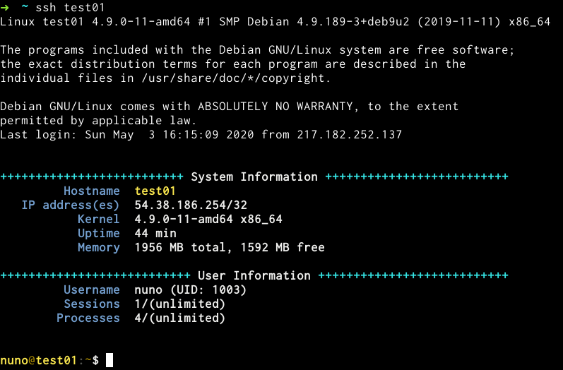

Workflow
========

Hardening Process
-----------------

Users and ssh keys
~~~~~~~~~~~~~~~~~~

To register a new server, this must be done through a station.

Requirements:

Have the hostname and password on passwordstore:
::

  ├── hostname1
  │   └── root
  └── hostname2
      └── root

For the first keys deployment update the variable `ansible_user` to root at `head host_vars/test01.yaml` 
::

  ---
  security: ovh/test01
  ansible_user: root
  hostname: test01

Registering process from metal:

- add/remove/update users and keys
- add users to sudoers
- personalise terminal environment

Firewall
~~~~~~~~

The firewall rules per host live at `host_vars/<host>.yaml`

CI/CD tool
----------

all the deployment operations should run from here.

Spinning up the CI/CD application
~~~~~~~~~~~~~~~~~~~~~~~~~~~~~~~~~

Requirements:
- a station running ansible
- has valid gpg keys.

Steps:
0. spin up a new server
1. deploy user keys and ssh hardening on target server
2. update DNS record for deploy.pulsingminds.com
3. generate and import gpg keys from the target server
4. deploy nci-ansible-ui on target
5. go to http://deploy.pulsingminds.com and trigger "smoke test"
6. check deployment output

Staging Environment
-------------------

### Requirements:

Staging environment should be able to be provisioned on demand from source control.

Tests Environment
-----------------

Production Environment
----------------------

